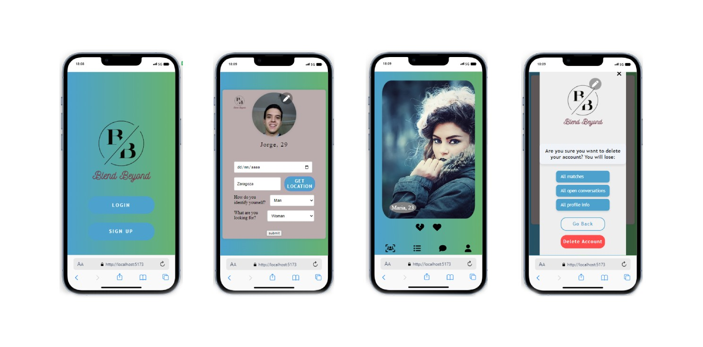

# Welcome to Blend Beyond 🚀

  

## 🌟 **A New Era of Dating**

Blend Beyond isn't just another dating app—it's a revolution! Step into a world where meaningful connections and unforgettable experiences await. With our cutting-edge technology and sleek design, love knows no bounds.

## 🚀 **Key Features**

- **Intelligent Form Handling**: Enjoy a smooth and hassle-free signup experience with React Hook Form, ensuring data accuracy and validation in real-time.
- **Personalized Matchmaking**: Discover meaningful connections tailored to your preferences, interests, and lifestyle.

- **Database Setup**: Created a robust database using Prisma and MongoDB to ensure data integrity and scalability.

- **User Models**: Designed comprehensive user models to enhance user data management and streamline operations.

- **Like/Dislike Tables**: Developed intermediate tables to manage many-to-many relationships for likes and dislikes, enhancing user interaction capabilities.

- **Controllers**: Built controllers to seamlessly connect the backend with the frontend, ensuring efficient data flow and functionality.

- **Filtering Logic**: Implemented controllers to filter users based on preferred gender and location, ensuring users don't see profiles they've already liked or disliked.

- **Geolocation**: Added functionality to determine user coordinates and find the nearest city, enhancing location-based matching.

- **Cloudinary**: To dinamically store data when updating user and delete them from Cloudinary when deleting user or changing pictures.

- **Image Storage**: Integrated Cloudinary for efficient image storage, allowing users to upload and store profile pictures securely.

- **Security**: Utilized bcrypt to hash passwords, significantly enhancing app security and protecting user data.

- **Security**: Utilized JWT to create tokens for logged users, and protecting routes with middlewares. 

- **Matched Users Controller**: Created a controller to filter and identify mutual likes, leveraging the many-to-many relationships to display matched users.

- **Logout and Delete Buttons**: Added functionality for users to log out and delete their accounts. The delete controller ensures all likes/dislikes and pictures from Cloudinary are removed, maintaining data cleanliness.

## 💻 **Technologies Used**

- **TypeScript**: Enhances code reliability and scalability, ensuring a robust and maintainable codebase.
- **React**: Powers the frontend user interface with its component-based architecture, delivering a responsive and dynamic experience.
- **MongoDB**: Provides a flexible and scalable NoSQL database solution, enabling efficient storage and retrieval of structured and unstructured data.
- **Prisma**: Facilitates database access and management through a type-safe query builder and ORM, streamlining development and ensuring data integrity.
- **Cloudinary**: Offers robust media management and delivery capabilities, allowing seamless integration for storing and serving images and other media assets in the application.
- **Styled Components**: Elevates the app's visual appeal with custom-styled components, ensuring a unique and memorable user experience.
- **React Router Dom**: Enables seamless navigation between different pages and components, enhancing user engagement and retention.
- **React Hook Form**: Simplifying form management and validation.
- **Styled Components**: Offering a convenient way to style React components with CSS.
- **Axios**: To simplify petitions to the backend.
- **bcrypt Library**: To hash passwords and improve security.
- **JWT**: Json Web Tokens to improve the app's routes security.

## 🌈 **Future Enhancements**

Blend Beyond is constantly evolving, and here's what's on the horizon:

- **Allowing users to filter people by means of controllers**: Enhance the user experience by implementing advanced filtering options, such as filtering by interests, hobbies, or compatibility scores, providing users with more control over their matches.

- **Chat between matches**:  Introduce a seamless chat feature that allows users to communicate with their matches directly within the app, fostering meaningful conversations and deeper connections.

- **AI-Powered Matchmaking**: Explore the possibilities of AI-driven algorithms to deliver more accurate and personalized matchmaking results, making every connection meaningful and impactful.

## 🚧 **Challenges Ahead**

While Blend Beyond aims for the stars, there are challenges to overcome:

- **Challenges and personality tests**: Integrating challenges to be played amongst people that have matched, together with personality tests will be crucial for scaling the application and delivering a seamless user experience. However, with dedication and perseverance, we're ready to tackle this challenge head-on.

## 📣 **Join the Blend Beyond Community**

Become part of the Blend Beyond journey today! Whether you're a developer, designer, or simply passionate about redefining the dating experience, we'd love to have you on board.

Let's blend beyond boundaries and create meaningful connections together! 💖

//skeletons en mensajes, matches y convers
//borrar mensaje al clicar
//maybe likedby/dislikedby PAYLOAD en el useReducer?
